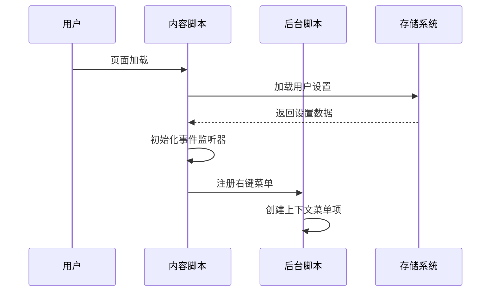
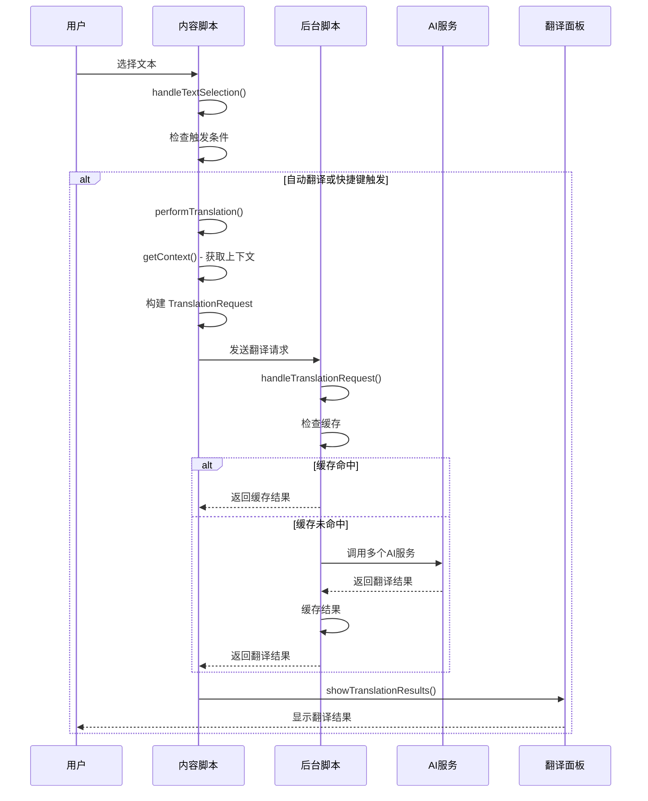
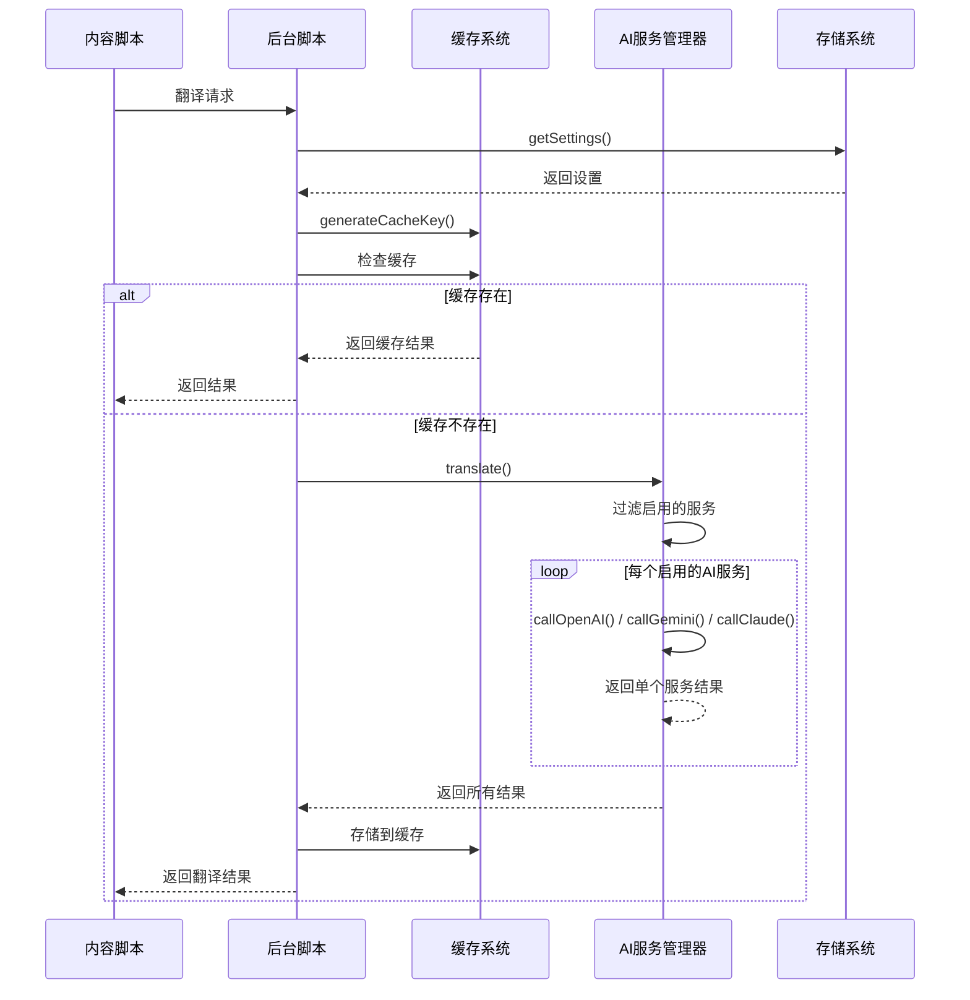
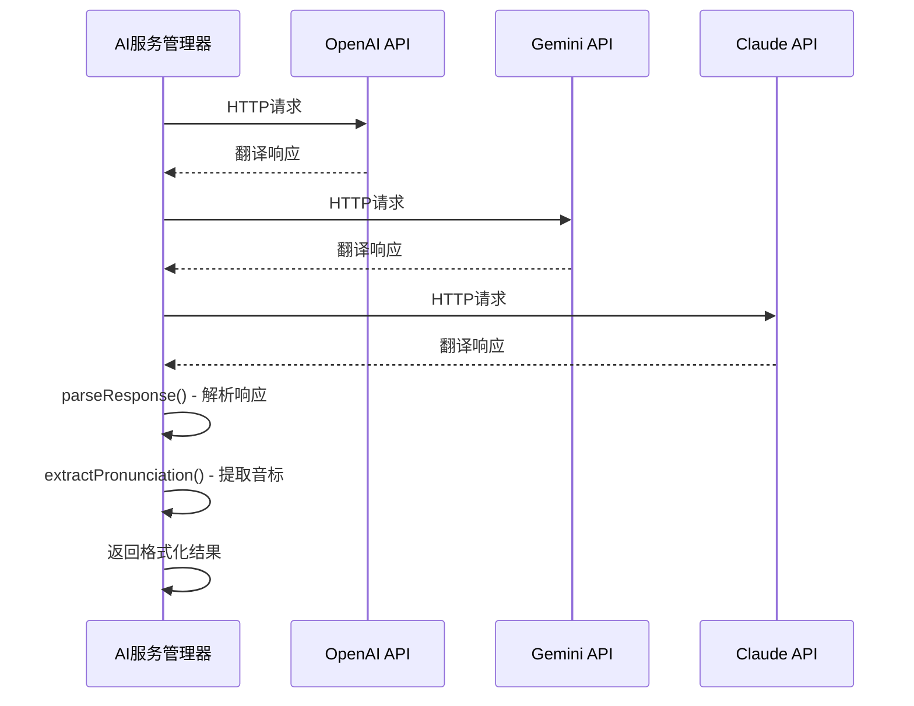
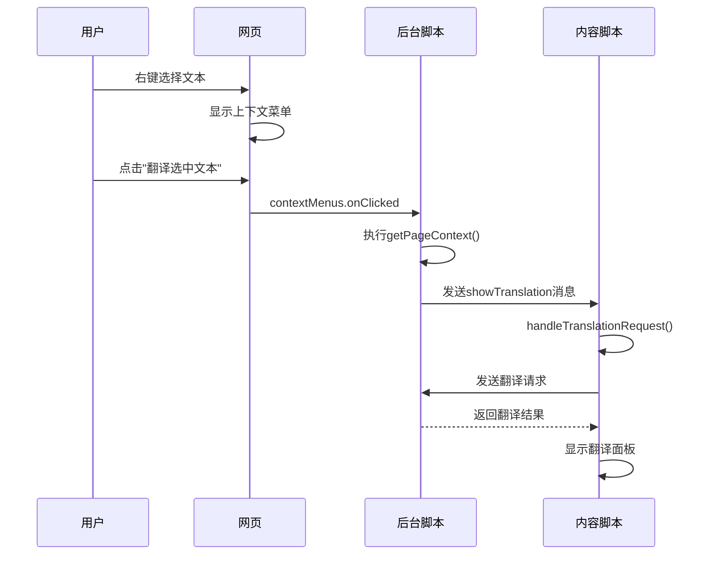
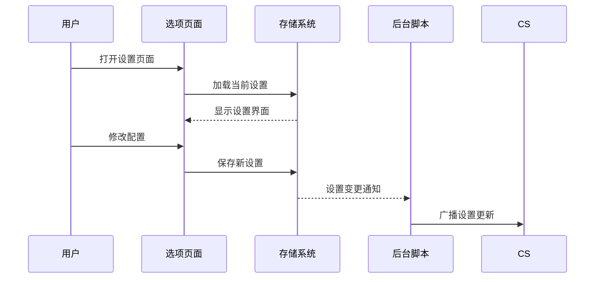

# Simple AI Translate - 代码执行流程详解

## 📋 概述

Simple AI Translate 是一个基于 Chrome 扩展的 AI 翻译工具，支持多个 AI 服务（OpenAI、Gemini、Claude 等），提供上下文感知的翻译功能。本文档详细解释了代码的执行流程和各组件之间的交互关系。

## 🏗️ 整体架构

```
┌─────────────────┐    ┌─────────────────┐    ┌─────────────────┐
│   用户界面      │    │   内容脚本      │    │   后台脚本      │
│                 │    │ (plasmo.ts)     │    │ (background.ts) │
│ • 选项页面      │◄──►│                 │◄──►│                 │
│ • 翻译面板      │    │ • 文本选择监听  │    │ • API 调用      │
│ • 右键菜单      │    │ • UI 渲染       │    │ • 缓存管理      │
└─────────────────┘    │ • 消息传递      │    │ • 设置管理      │
                       └─────────────────┘    └─────────────────┘
                                │                        │
                                ▼                        ▼
                       ┌─────────────────┐    ┌─────────────────┐
                       │   AI 服务管理   │    │   存储系统      │
                       │ (ai-service.ts) │    │ (Chrome Storage)│
                       │                 │    │                 │
                       │ • API 调用      │    │ • 设置持久化    │
                       │ • 响应解析      │    │ • 缓存数据      │
                       │ • 错误处理      │    │ • 跨设备同步    │
                       └─────────────────┘    └─────────────────┘
```

## 🔄 核心执行流程

### 1. 扩展初始化流程



**详细步骤：**
1. **页面加载时** (`plasmo.ts` 第298-313行)
   - 内容脚本自动注入到所有网页
   - 触发 `window.addEventListener('load')` 事件
   - 调用 `loadSettings()` 从 Chrome 存储中获取用户配置

2. **设置加载** (`plasmo.ts` 第15-24行)
   - 使用 `chrome.runtime.sendMessage({ action: 'getSettings' })`
   - 后台脚本响应并返回存储的设置
   - 更新本地 `settings` 状态变量

3. **事件监听器初始化** (`plasmo.ts` 第304-312行)
   - 添加 `mouseup` 和 `keyup` 事件监听器
   - 设置点击外部区域隐藏翻译面板的逻辑

### 2. 文本选择和翻译触发流程



**详细步骤：**

1. **文本选择检测** (`plasmo.ts` 第272-287行)
   - 用户释放鼠标或键盘时触发 `handleTextSelection()`
   - 获取 `window.getSelection()` 对象
   - 检查是否有有效文本选择

2. **触发条件判断** (`plasmo.ts` 第280-282行)
   ```typescript
   const shouldTranslate = settings.autoTranslate || 
     (window.event && (window.event as KeyboardEvent)[settings.triggerKey + 'Key'])
   ```
   - 检查是否启用自动翻译
   - 检查是否按下触发快捷键（Alt/Ctrl/Shift）

3. **翻译执行** (`plasmo.ts` 第215-269行)
   - 设置 `isTranslating = true` 防止重复请求
   - 调用 `getContext(selectedText)` 获取上下文信息
   - 分析文本类型（单词或句子）
   - 查找单词在上下文中的位置索引

4. **上下文获取** (`plasmo.ts` 第183-212行)
   ```typescript
   function getContext(selectedText: string): string {
     const selection = window.getSelection()
     const range = selection.getRangeAt(0)
     // 向上遍历DOM树找到合适的容器
     // 优先选择段落级别元素
   }
   ```
   - 智能提取选中文本周围的段落内容
   - 为 AI 提供更丰富的上下文信息

### 3. 后台脚本处理流程



**详细步骤：**

1. **消息接收和处理** (`background.ts` 第12-45行)
   ```typescript
   chrome.runtime.onMessage.addListener((message, sender, sendResponse) => {
     if (message.action === 'translate') {
       handleTranslationRequest(message.data, sendResponse)
     }
   })
   ```

2. **缓存机制** (`background.ts` 第47-70行)
   ```typescript
   function generateCacheKey(request: TranslationRequest): string {
     return `${request.selectedText}-${request.context}-${request.isWord}`
   }
   ```
   - 基于选中文本、上下文和文本类型生成唯一缓存键
   - 避免重复的 API 调用，提高性能

3. **AI 服务调用** (`ai-service.ts` 第25-80行)
   ```typescript
   async translate(request: TranslationRequest): Promise<TranslationResult> {
     const enabledServices = this.settings.aiServices.filter(service => service.enabled)
     const results = await Promise.allSettled(
       enabledServices.map(service => this.callAIService(service, request))
     )
   }
   ```
   - 并行调用所有启用的 AI 服务
   - 使用 `Promise.allSettled` 确保单个服务失败不影响其他服务

### 4. AI 服务 API 调用流程



**详细步骤：**

1. **OpenAI API 调用** (`ai-service.ts` 第82-110行)
   ```typescript
   private async callOpenAI(service: AIService, request: TranslationRequest) {
     const response = await fetch(`${service.baseUrl}/chat/completions`, {
       method: 'POST',
       headers: {
         'Authorization': `Bearer ${service.apiKey}`,
         'Content-Type': 'application/json'
       },
       body: JSON.stringify({
         model: service.model,
         messages: [{ role: 'user', content: prompt }]
       })
     })
   }
   ```

2. **响应解析** (`ai-service.ts` 第150-180行)
   ```typescript
   private parseResponse(response: any, service: AIService): AIServiceResult {
     // 解析不同AI服务的响应格式
     // 提取翻译文本、音标、详细含义
   }
   ```

### 5. 右键菜单翻译流程



**详细步骤：**

1. **右键菜单创建** (`background.ts` 第72-78行)
   ```typescript
   chrome.runtime.onInstalled.addListener(() => {
     chrome.contextMenus.create({
       id: 'translateSelection',
       title: '翻译选中文本',
       contexts: ['selection']
     })
   })
   ```

2. **页面上下文获取** (`background.ts` 第95-120行)
   ```typescript
   function getPageContext(): string {
     // 注入到页面中执行的函数
     // 获取选中文本周围的段落内容
   }
   ```

## 🔧 配置管理流程

### 选项页面配置流程



**详细步骤：**

1. **设置加载** (`options.tsx` 第13-22行)
   ```typescript
   const loadSettings = async () => {
     const result = await chrome.storage.sync.get('settings')
     if (result.settings) {
       setSettings(result.settings)
     }
   }
   ```

2. **设置保存** (`options.tsx` 第24-31行)
   ```typescript
   const saveSettings = async (newSettings: ExtensionSettings) => {
     await chrome.storage.sync.set({ settings: newSettings })
     setSettings(newSettings)
   }
   ```

3. **AI 服务管理** (`options.tsx` 第33-58行)
   - 支持添加自定义 AI 服务
   - 动态启用/禁用服务
   - 配置 API 密钥和模型参数

## 🎯 关键技术点

### 1. 消息传递机制

Chrome 扩展使用消息传递在不同组件间通信：

```typescript
// 内容脚本 -> 后台脚本
chrome.runtime.sendMessage({
  action: 'translate',
  data: translationRequest
})

// 后台脚本 -> 内容脚本
chrome.tabs.sendMessage(tabId, {
  action: 'showTranslation',
  data: translationRequest
})
```

### 2. 缓存策略

实现智能缓存避免重复 API 调用：

```typescript
const cacheKey = generateCacheKey(request)
const cached = await cache.get(cacheKey)
if (cached) {
  return cached
}
// 否则进行 API 调用并缓存结果
```

### 3. 并发处理

使用 `Promise.allSettled` 并行调用多个 AI 服务：

```typescript
const results = await Promise.allSettled(
  enabledServices.map(service => this.callAIService(service, request))
)
```

### 4. 错误处理

完善的错误处理确保单个服务失败不影响整体功能：

```typescript
try {
  const response = await chrome.runtime.sendMessage(request)
  if (response.success) {
    showTranslationResults(response.results, selectedText)
  } else {
    showTranslationResults([{
      serviceId: 'error',
      serviceName: 'Error',
      translation: '',
      error: response.error
    }], selectedText)
  }
} catch (error) {
  console.error('Translation error:', error)
}
```

## 📁 文件结构说明

```
src/
├── types.ts              # TypeScript 类型定义
├── ai-service.ts         # AI 服务管理和 API 调用
├── background.ts         # 后台脚本，处理 API 调用和缓存
├── contents/
│   └── plasmo.ts         # 内容脚本，处理用户交互
├── options.tsx           # 选项页面，用户配置界面
├── popup.tsx             # 扩展弹窗界面
├── newtab.tsx            # 新标签页界面
└── style.css             # 样式文件
```

## 🚀 性能优化

1. **缓存机制**：避免重复的 API 调用
2. **并发处理**：并行调用多个 AI 服务
3. **懒加载**：按需加载翻译面板
4. **防抖处理**：防止频繁的翻译请求
5. **状态锁**：避免重复翻译同一文本

## 🔒 安全考虑

1. **API 密钥保护**：使用密码类型输入框
2. **内容安全策略**：遵循 Chrome 扩展安全规范
3. **权限最小化**：只请求必要的扩展权限
4. **数据验证**：验证 API 响应数据格式

## 📝 总结

Simple AI Translate 通过模块化的设计实现了高效的 AI 翻译功能：

- **内容脚本**负责用户交互和 UI 展示
- **后台脚本**处理 API 调用和数据缓存
- **AI 服务管理器**统一管理多个 AI 服务的调用
- **选项页面**提供灵活的配置界面

整个系统通过 Chrome 扩展的消息传递机制实现组件间通信，通过缓存机制优化性能，通过错误处理确保稳定性。这种架构设计使得扩展既功能强大又易于维护和扩展。